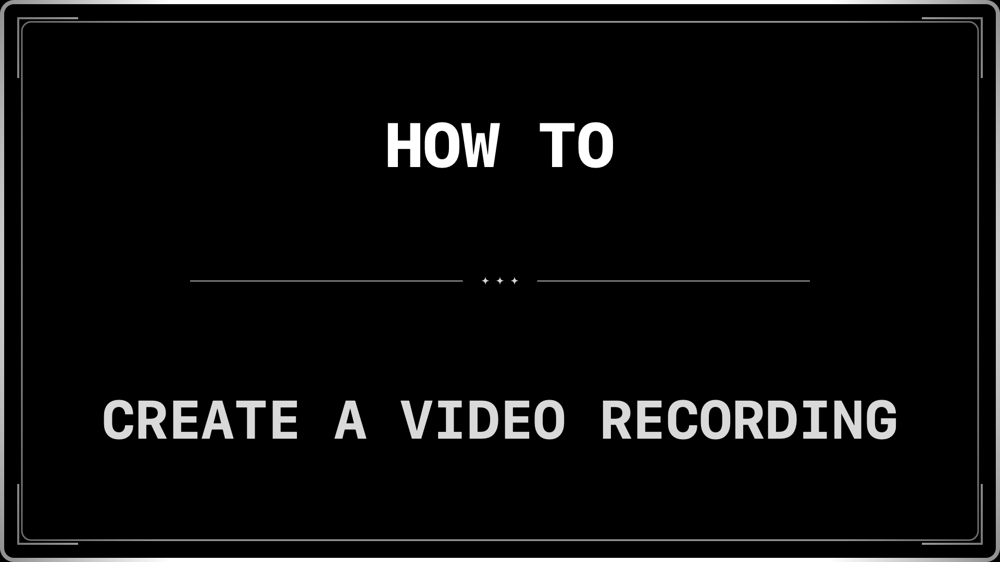

# Silent Card Caption

A single-file, zero-dependency web page for creating **old-timey silent-film style caption cards** and exporting them as **PNG images** for video use.

Think: white monospaced text on black, vintage borders, subtle film grain, and perfectly centered titles—ready for drop-in use with modern video editors.

---

## Features

- 🎞 **Silent movie aesthetic**
  - Black background, white monospaced text
  - Double-line frame, corner accents, ornamental dividers
  - Optional film grain, vignette, and flicker

- ✍️ **Editable in place**
  - Click directly on the title (`h1`) or subtitle (`h2`) and type
  - Supports 1–3+ lines (manual line breaks supported)

- 💾 **Persistent text**
  - Captions are saved automatically in `localStorage`
  - Reload the page and your last text is still there

- 🖼 **High-resolution PNG export**
  - 1080p (1920×1080)
  - 2×1080p / 4K (3840×2160) — default
  - 4×1080p / 8K (7680×4320)
  - Clean export option (no grain or flicker)

- 📐 **Correct video aspect ratio**
  - Preview always matches 16:9 (1080p)
  - Export matches exactly—no scaling surprises

- 📦 **Single HTML file**
  - No build step
  - No external libraries
  - Works offline

---

## Usage

1. **Open the file**
   - Save the HTML file (e.g. `silent-card.html`)
   - Open it in any modern browser (Safari, Chrome, Firefox)

2. **Edit the text**
   - Click the top heading to edit the title
   - Click the bottom text to edit the subtitle
   - Press `Enter` to create multi-line captions

3. **Choose export options**
   - Select your export size (default: 2×1080p / 4K)
   - Optionally enable **Clean PNG** for no film effects

4. **Export**
   - Click **Download PNG**
   - Drop the exported image directly into your video editor

---

## Keyboard Shortcuts

- **⌘ / Ctrl + S** — Save caption text (stored locally in browser)

---

## Notes

- Text is rendered directly to canvas during export for **crisp, resolution-independent results**
- Exported PNG filenames are automatically derived from the title text
- Designed for title cards, intertitles, and chapter breaks in videos

---

## Ideas / Extensions

- Custom fonts or font weight presets
- Fade-in / fade-out frame sequences
- Batch export multiple caption slides
- Subtitle-only mode
- Non-16:9 formats (9:16, 1:1, 4:3)

---

## License

Do whatever you want with it.  
If it ends up in a film reel projector in a haunted theater, even better 🎥
